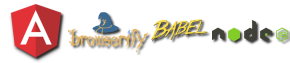

# Angularity

Build projects, not build systems.

- Hand picked and industry proven front end technologies.
- A complete and scalable single page application workflow.

## Features

A complete frontend development solution for:
modules, minification, source maps, linting, testing, live reloading, release and workflow tooling

- No complicated build files per project
- Kickstart your workflow with IDE integration and command line interface
- Write with the latest ES6 Javascript features
- Use CommonJs/NodeJs syntax
- In-built support for Karma tests
- Build with minification and source-map safe bundles
- Use both Bower and NPM for your vendor dependencies
- Convenient CI integration with custom reporters
- Plugin system to create your own tasks

## Documentation

[angularity.github.io](http://angularity.github.io)

## Maintained by

Ben Holloway, Chris Decoster, Brendan Graetz

## Licence

MIT
